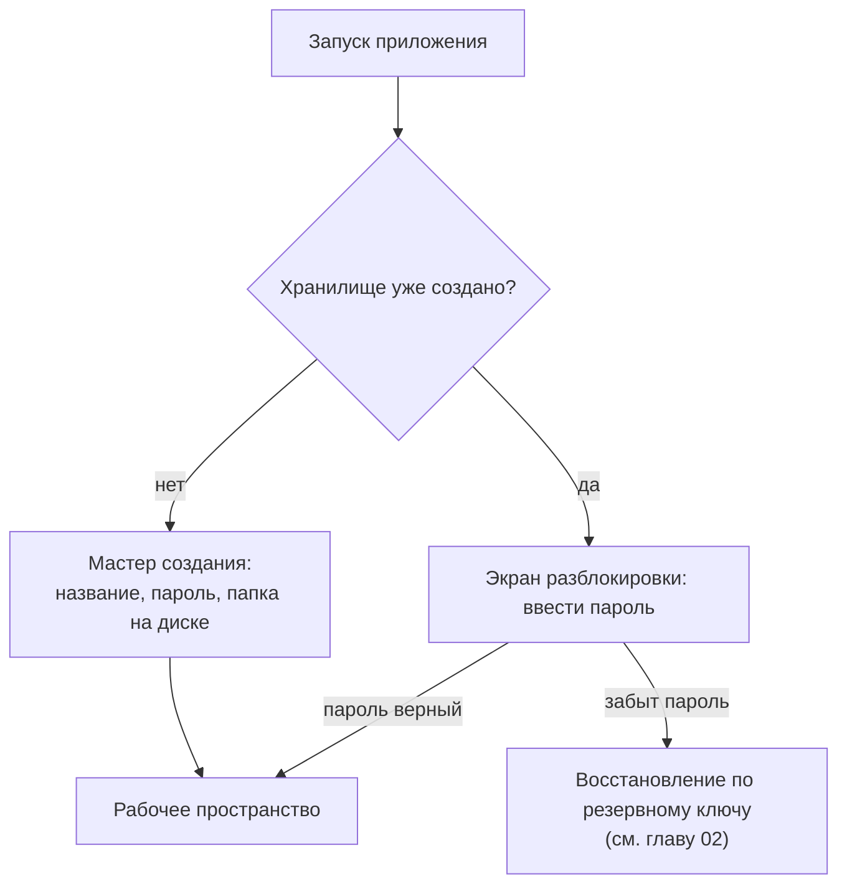
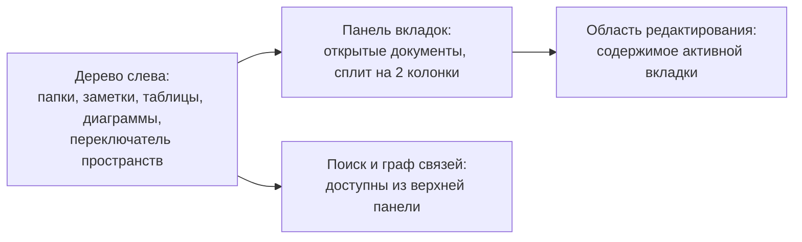

# 01. Первый запуск и хранилище

## Что такое хранилище (vault)

Всё, что вы создаёте в SynapDesk — заметки, таблицы, диаграммы, PDF, — лежит в одном **хранилище**: папке на вашем
диске, доступ к которой защищён паролем. Можно завести несколько хранилищ (например, «Личное» и «Работа») и
переключаться между ними при запуске — как между разными аккаунтами.

## Первый запуск

1. При первом запуске откроется мастер создания хранилища. Задайте имя (это ваш логин внутри приложения) и пароль —
   он же будет ключом шифрования всех данных, поэтому его нельзя восстановить без резервного ключа (см. главу
   [02. Пароли и безопасность](storage.md)).
2. Выберите, где на диске будет храниться хранилище — по умолчанию предлагается стандартная папка приложения, но
   можно указать любую (например, папку в облачном диске для собственной синхронизации файлов).
3. После создания приложение покажет **резервный ключ** — набор групп символов вида `abcd-efgh-ijkl-mnop`.
   Сохраните его в надёжном месте (менеджер паролей, распечатка) — это единственный способ вернуть доступ, если вы
   забудете основной пароль.
4. Дальше открывается рабочее пространство — пустое дерево слева и область редактирования справа.

## Разблокировка при следующих запусках

При каждом следующем запуске приложение просит пароль. Если включена опция «Запомнить», пароль сохраняется в
системном хранилище паролей вашей ОС (Keychain на macOS, Credential Manager на Windows) — и разблокировка происходит
автоматически, без ввода пароля каждый раз.

Если у вас несколько хранилищ, при запуске появится список — выберите нужное и введите его пароль.

## Из чего состоит рабочее пространство

- **Дерево** — иерархия папок со всеми вашими документами. Поддерживает несколько **пространств** (workspaces) —
  независимых верхнеуровневых разделов внутри одного хранилища, между которыми можно переключаться сверху.
- **Вкладки** — открытые документы, как в браузере; можно включить **сплит** — два столбца одновременно с
  независимой или синхронной прокруткой (подробнее в главе [11](11-frontend-architecture.md)).
- **Поиск** и **граф связей** — отдельная кнопка/вкладка сверху, подробности в главах
  [08](08-search.md) и [07](07-graph.md).

## Первая настройка: с чего начать

Рекомендуемый порядок работы с новым хранилищем:

1. Создайте несколько папок под темы или проекты (правый клик по дереву → «Новая папка»).
2. Начните с диаграммы — mind map, чтобы разложить тему на узлы (глава [06](06-diagrams.md)).
3. Разверните узлы диаграммы в полноценные заметки и таблицы, свяжите их ссылками `[[…]]` (глава
   [04](04-editor-notes.md)).
4. Подложите PDF-источники в ту же папку и ссылайтесь на них из заметок (глава [09](09-native-platform.md)).
5. Периодически открывайте граф связей, чтобы увидеть картину целиком (глава [07](07-graph.md)).

## Переключение и добавление хранилищ

Через Настройки → Хранилище можно:

- создать ещё одно хранилище с отдельным паролем;
- переключиться на другое существующее хранилище;
- изменить расположение папки хранилища на диске;
- запустить миграцию старого формата хранилища на новый (с поддержкой второго пароля-прикрытия и шифрования
  диска) — мастер миграции проведёт через все шаги и сохранит резервную копию перед началом.

## Далее

- Как устроены пароли, шифрование и что делать, если забыли пароль — [02. Пароли и безопасность](storage.md).
- Как включить синхронизацию между своими устройствами — [03. Синхронизация и совместная работа](03-sync-collab.md).
