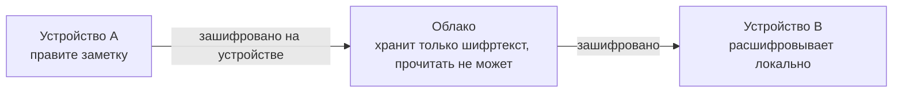
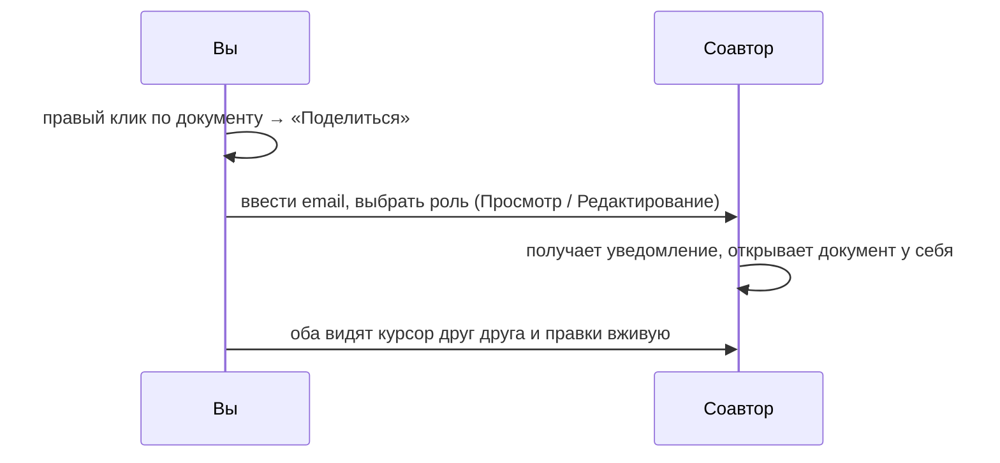

# 03. Синхронизация и совместная работа

Эта глава — про два разных, но связанных сценария: синхронизацию **своих** устройств между собой и совместное
редактирование **с другими людьми**.

## Синхронизация между своими устройствами

По умолчанию хранилище живёт только на одном устройстве. Чтобы видеть те же заметки на телефоне (в будущем) или
втором компьютере, нужно включить синхронизацию:

1. Настройки → Синхронизация → «Включить».
2. Создайте аккаунт (email + код подтверждения) или войдите в существующий.
3. На втором устройстве войдите тем же аккаунтом и подключите то же хранилище.

Данные шифруются **до** отправки и расшифровываются только на устройстве получателя — сервер синхронизации в
любой момент видит лишь непрозрачный зашифрованный блок, не содержимое.

**Как это ощущается на практике:**

- Изменения долетают до второго устройства в течение нескольких секунд при наличии сети.
- Работа офлайн поддерживается полностью — правки копятся локально и отправляются, как только связь появится.
- Если вы правили один и тот же документ на двух устройствах офлайн одновременно, при синхронизации оба набора
  правок автоматически объединяются без потери текста — конфликт-диалогов «выбери версию» не возникает.
- Индикатор статуса синхронизации — в нижней части бокового меню: «Синхронизировано» / «Синхронизация…» /
  «Офлайн» / «Ошибка».
- Перенос заметки в другую папку или переименование синхронизируется как одно действие, а не как удаление +
  создание — файл не задваивается на втором устройстве.
- Удаление синхронизируется тоже: удалённая на одном устройстве заметка исчезнет на остальных при следующей
  синхронизации.

Управление устройствами: Настройки → Синхронизация → «Устройства» — список всех подключённых устройств с
возможностью отозвать доступ у любого (например, если ноутбук потерян).

## Совместное редактирование в реальном времени

Заметку, таблицу, диаграмму или целую папку можно расшарить другому человеку по email — примерно как открыть
общий доступ к документу.

**Как поделиться:**

1. Правый клик на документе или папке в дереве → «Поделиться».
2. Введите email получателя.
3. Выберите роль:
   - **Просмотр** — получатель видит содержимое, редактировать не может.
   - **Редактирование** — получатель может править документ наравне с вами.
4. Получатель увидит расшарённый документ в разделе «Доступно мне» и сможет открыть его.

**Что происходит при совместной работе:**

- Несколько человек могут одновременно печатать в одной заметке — курсор и правки каждого видны остальным в
  реальном времени, как при совместной работе над документом.
- Работает и офлайн: если кто-то из соавторов временно потерял связь, его правки применятся автоматически при
  восстановлении соединения, без ручного слияния.
- Роль «Просмотр» физически не даёт редактировать — поле ввода становится нередактируемым.
- Расшарить можно и папку целиком — тогда права распространяются на все документы внутри неё.
- Отозвать доступ можно в любой момент: правый клик → «Поделиться» → удалить получателя из списка.

## Как безопасно устроен шаринг

Когда вы расшариваете документ, ключ шифрования именно этого документа передаётся получателю в зашифрованном виде,
который может открыть только он сам — сервер, через который проходит приглашение, не может прочитать ни сам
документ, ни ключ к нему. Технически это устроено так, что даже если бы сервер захотел подсмотреть содержимое, у
него физически нет для этого ключа.

## Что делать при проблемах с синхронизацией

- **Изменения не долетают** — проверьте статус в Настройках → Синхронизация; попробуйте «Синхронизировать сейчас»
  вручную.
- **Конфликт после долгого офлайна** — не потребуется: система сливает изменения автоматически (см. выше); если
  что-то выглядит потерянным, проверьте историю версий заметки (глава [10](10-backup-history.md)).
- **Соавтор не видит документ** — убедитесь, что письмо-приглашение подтверждено (получатель должен войти в
  приложение под тем же email) и что доступ не был случайно отозван.

## Далее

- Как работает редактор, который синхронизируется в реальном времени — [04. Заметки и редактор](04-editor-notes.md).
- Как зашифровано содержимое, которое видит только владелец ключа — [02. Пароли и безопасность](storage.md).
