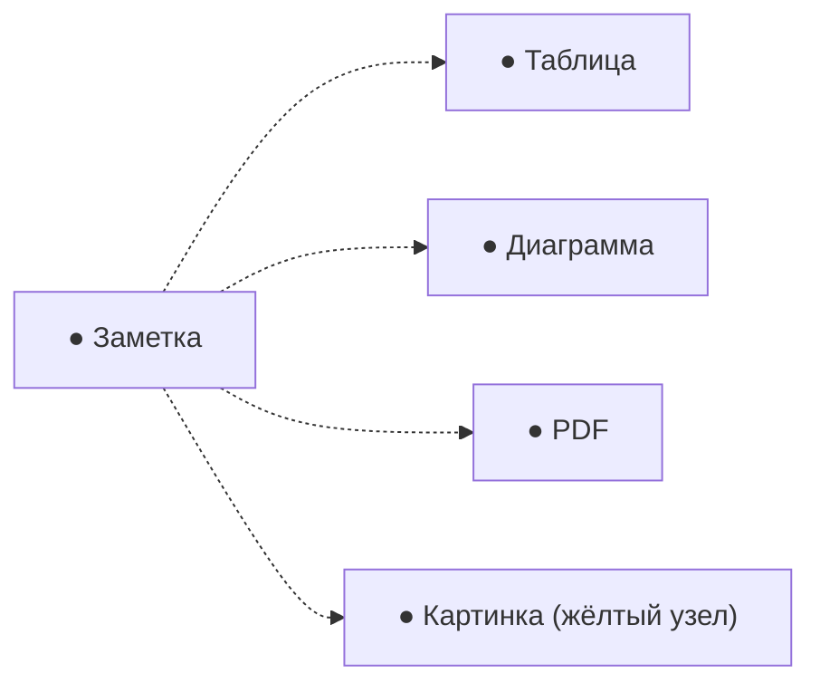

# 07. Граф связей

## Как открыть

Кнопка «Граф» в верхней панели (или иконка в дереве) открывает граф отдельной вкладкой. Каждый узел — документ:
заметка, таблица, диаграмма, PDF или картинка; линия между узлами — ссылка `[[…]]` из одного документа в другой.
Никакой отдельной настройки не требуется — граф автоматически строится по всем ссылкам, которые вы уже расставили
в заметках, ячейках таблиц и вложениях диаграмм.

## Как читать граф

- Размер узла зависит от количества связей — часто упоминаемые заметки крупнее, изолированные документы без
  ссылок — маленькие и на периферии.
- Цвет узла соответствует типу документа — легенда справа расшифровывает, какой цвет что означает.
- Клик по узлу открывает документ; двойной клик центрирует граф на нём и подсвечивает его прямых соседей.
- Тащите узлы мышью, чтобы вручную расставить их удобнее — граф запоминает положение при следующем открытии.
- Колесо мыши — зум, зажатая левая кнопка на пустом месте — панорама.

## Легенда и фильтры

Клик по типу документа в легенде справа подсвечивает только узлы этого типа, остальные тускнеют — удобно, чтобы
быстро увидеть, например, только PDF-источники или только диаграммы. Повторный клик снимает фильтр.

## Поиск по графу

Поле поиска в левом верхнем углу графа фильтрует узлы по названию — начните печатать, и все совпадения
подсветятся, `Enter` центрирует граф на первом найденном. Полезно в большом хранилище, где визуально найти нужный
узел среди сотен сложно.

Можно также настроить собственные цветовые группы по шаблону названия (например, все заметки, начинающиеся с
«Проект:», одним цветом) — через панель настроек графа справа.

## Практическое применение

Граф — способ время от времени «отступить на шаг назад» и увидеть, как связаны между собой темы, над которыми вы
работаете: изолированные узлы без единой связи — сигнал, что стоит добавить ссылку на смежные материалы; плотные
скопления — уже сложившиеся тематические кластеры, которые может быть полезно вынести в отдельное пространство или
папку верхнего уровня.

## Далее

- Как расставлять ссылки, из которых строится граф — [04. Заметки и редактор](04-editor-notes.md#wiki-ссылки-связывайте-заметки-таблицы-и-диаграммы).
- Полнотекстовый поиск (отдельный от поиска по графу) — [08. Поиск](08-search.md).
