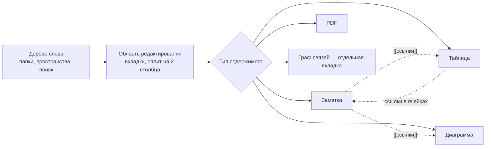

# Руководство пользователя SynapDesk

Подробная инструкция по всем функциям приложения: что есть, где находится в интерфейсе и как этим пользоваться —
с пошаговыми сценариями и диаграммами для сложных мест.

Главный [README.md](../README.md) репозитория — краткий обзор, установка, разработка. Здесь — детальное руководство
по каждой функции.

## Как читать

Главы идут в порядке освоения приложения: сначала первый запуск и работа с хранилищем (без этого остальное не
имеет смысла), затем синхронизация и совместная работа, затем содержимое — заметки, таблицы, диаграммы, граф, поиск,
и в конце — вспомогательные функции (голос, PDF, бэкапы) и общие приёмы работы с интерфейсом.

## Оглавление

| № | Глава | О чём |
|---|-------|-------|
| 01 | [Первый запуск и хранилище](01-architecture.md) | Создание хранилища, разблокировка, из чего состоит рабочее пространство |
| 02 | [Пароли и безопасность](storage.md) | Основной пароль, пароль-прикрытие, шифрование диска, резервный ключ, где физически лежат файлы |
| 03 | [Синхронизация и совместная работа](03-sync-collab.md) | Включение синхронизации между своими устройствами, шаринг заметки/папки по email, права «Просмотр»/«Редактирование» |
| 04 | [Заметки и редактор](04-editor-notes.md) | Форматирование текста, режим Markdown, wiki-ссылки, вставка диаграмм/формул/интерактивных графиков, вкладки и сплит |
| 05 | [Таблицы](05-sheets.md) | Создание таблицы, формулы, ссылки на ячейки, избранное |
| 06 | [Диаграммы и mind map](06-diagrams.md) | Бесконечный холст, блоки и стрелки, вложения, экспорт |
| 07 | [Граф связей](07-graph.md) | Как читать граф, легенда, поиск и группировка узлов |
| 08 | [Поиск](08-search.md) | Быстрый поиск по заголовкам и полнотекстовый поиск по содержимому |
| 09 | [Голос, распознавание и PDF](09-native-platform.md) | Диктовка, озвучка заметок, распознавание текста на картинках, экспорт и вставка PDF |
| 10 | [Бэкапы и история версий](10-backup-history.md) | Резервные копии, восстановление, история правок заметки |
| 11 | [Рабочее пространство и горячие клавиши](11-frontend-architecture.md) | Дерево папок, множественный выбор, drag-and-drop, вкладки, горячие клавиши |

## Общая схема рабочего пространства

Всё содержимое хранится локально на вашем диске и зашифровано — подробности в главе
[02. Пароли и безопасность](storage.md).

Далее — по главам.
