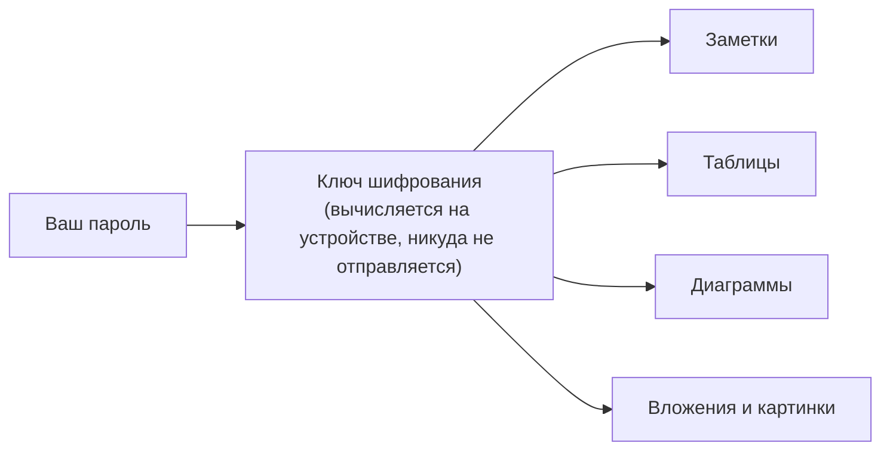

# 02. Пароли и безопасность

## Что зашифровано и почему это важно

Всё содержимое ваших заметок, таблиц и диаграмм хранится на диске в зашифрованном виде. Без пароля никто —
включая вас без резервного ключа — не сможет прочитать данные напрямую из файлов. Это касается и облачной
синхронизации: если она включена, на сервер уходит только зашифрованное содержимое, сам пароль никогда не
покидает ваше устройство.



## Два пароля: основной и прикрытие

В хранилище можно настроить **два независимых пароля**:

- **Основной пароль (A)** — открывает всё содержимое хранилища.
- **Пароль-прикрытие (B)** — необязательный. Открывает хранилище, но показывает только те записи, которые вы
  заранее пометили как «видимые в режиме прикрытия». Всё остальное содержимое просто не отображается, как будто
  его не существует.

Это на случай, если открыть приложение вас просят под давлением (например, на границе или при задержании) — вы
вводите пароль-прикрытие, и приложение честно открывается, но показывает только заранее подготовленный, безобидный
набор заметок.

**Как настроить:**

1. Настройки → Безопасность → «Добавить пароль-прикрытие».
2. Задайте отдельный пароль B — он должен отличаться от основного.
3. Для каждой заметки, таблицы или диаграммы, которую нужно сделать видимой в режиме прикрытия, откройте
   контекстное меню → «Показывать в режиме прикрытия». По умолчанию новые записи видны только под основным
   паролем.
4. Проверьте: заблокируйте хранилище и разблокируйте паролем B — должны быть видны только помеченные записи.

Важно понимать: пароль-прикрытие скрывает записи в интерфейсе и в базе данных приложения, но не превращает их в
математически недоказуемые для внешнего эксперта с полным доступом к диску — по-настоящему надёжна эта схема
только вместе с включённым **шифрованием диска** (см. ниже), при котором и сами файлы-зеркала заметок на диске
тоже зашифрованы, а не лежат обычным текстом.

## Шифрование диска

Кроме основной базы данных, каждая заметка по умолчанию дублируется на диск обычным текстовым файлом (`.md`) — это
удобно для чтения и редактирования вне приложения. Опция **«Шифровать зеркало на диске»** (Настройки →
Безопасность) переключает эти файлы на зашифрованный формат — тогда даже прямой доступ к папке хранилища на
файловой системе не даёт прочитать содержимое без пароля.

Рекомендуется включать эту опцию вместе с паролем-прикрытием — иначе скрытые в интерфейсе записи всё ещё можно
прочитать напрямую из файлов на диске.

## Резервный ключ

Показывается один раз при создании хранилища (или при переходе на новый формат хранилища) — набор символов вида
`abcd-efgh-ijkl-mnop`. Это единственный способ восстановить доступ к основному паролю, если вы его забыли.
**Сохраните его отдельно от устройства** — в менеджере паролей или распечатанным.

Восстановление: экран разблокировки → «Забыли пароль?» → ввести резервный ключ → задать новый основной пароль.

Пароль-прикрытие резервным ключом не восстанавливается — если вы забыли его отдельно, доступ к записям, видимым
только в режиме прикрытия, теряется без возможности восстановления (это осознанный компромисс: сервер и резервный
механизм в принципе не должны знать о существовании прикрытия).

## Где физически лежат файлы

```
macOS:   ~/Library/Application Support/SynapDesk/
Windows: %APPDATA%\SynapDesk\
Linux:   ~/.local/share/SynapDesk/
```

Внутри — папка `vaults/`, где каждое ваше хранилище — отдельная подпапка. Если нужно перенести хранилище на другой
компьютер вручную (без облачной синхронизации) — скопируйте всю эту подпапку целиком и откройте её через
Настройки → Хранилище → «Открыть хранилище по пути» на новом устройстве.

## Пароль приложения и пароль аккаунта — не одно и то же

Если вы включаете облачную синхронизацию или совместную работу (глава [03](03-sync-collab.md)), вам предложат
создать **аккаунт по email** — отдельная сущность для входа с других устройств и приглашения соавторов. Этот
пароль/email **не открывает ваше хранилище** — сервер вообще не хранит и не видит пароль от хранилища. Даже
получив полный доступ к вашему аккаунту, никто не сможет прочитать содержимое ваших заметок без основного пароля
или резервного ключа.

| Что | Где настраивается | Что открывает |
|---|---|---|
| Основной пароль (A) | Настройки → Безопасность | Полный доступ к хранилищу |
| Пароль-прикрытие (B) | Настройки → Безопасность | Только помеченные записи |
| Резервный ключ | Показан при создании; восстановление в Настройках | Восстанавливает основной пароль |
| Аккаунт (email) | Настройки → Синхронизация | Синхронизацию и приглашения к совместной работе — **не** хранилище |

## Резервная копия вручную

Помимо автоматических бэкапов (глава [10](10-backup-history.md)) можно в любой момент скопировать папку
хранилища целиком (см. «Где физически лежат файлы» выше) — это самая надёжная резервная копия. Для восстановления
из такой копии на другом устройстве понадобится основной пароль или резервный ключ.
